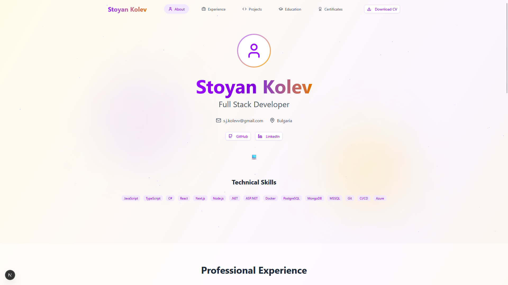

# Kolev Resume

A modern, customizable resume web app built with Next.js. Easily showcase your experience, education, projects, and more with a clean, responsive design.

---

## Features
- Built with Next.js
- Modular, component-based structure
- Easily customizable resume data
- Responsive and modern UI
- PDF download support

---

## Getting Started

1. **Install dependencies:**
   ```bash
   npm install
   ```
2. **Run the development server:**
   ```bash
   npm run dev
   ```
3. Open [http://localhost:3000](http://localhost:3000) in your browser.

---

## Customization
- Update styles in `app/globals.css` or component files.
- Add new sections or modify existing ones in `components/ui/resumeComponents/`.
- Update favicon and images in `public/`.

---

## Screenshots

| Home Page |
|-----------|
|  |

---